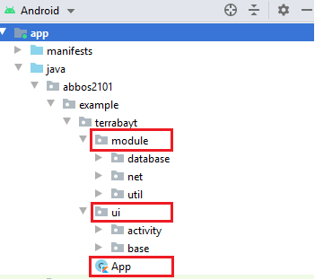
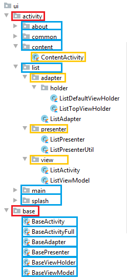
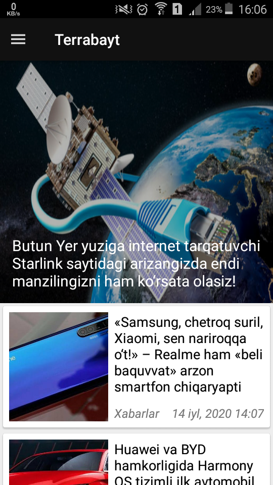
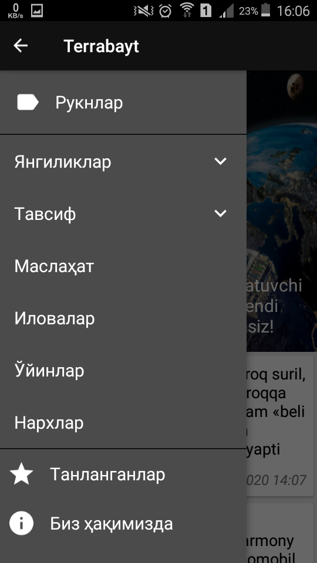
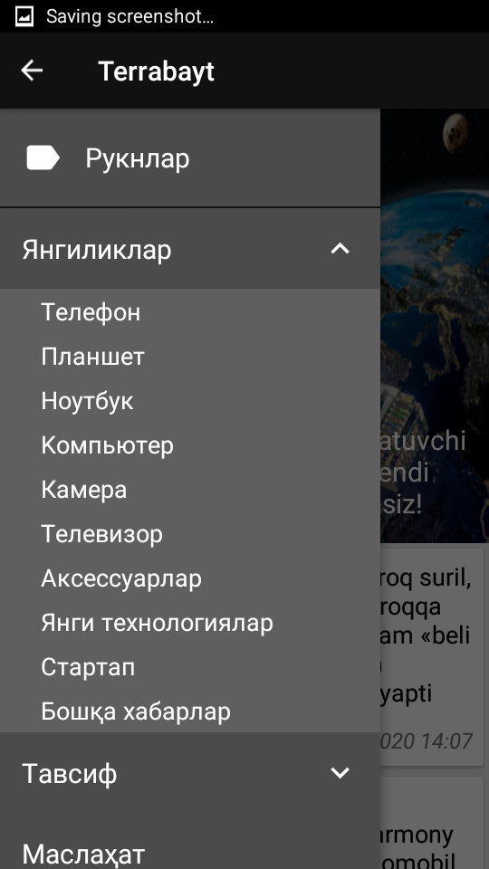
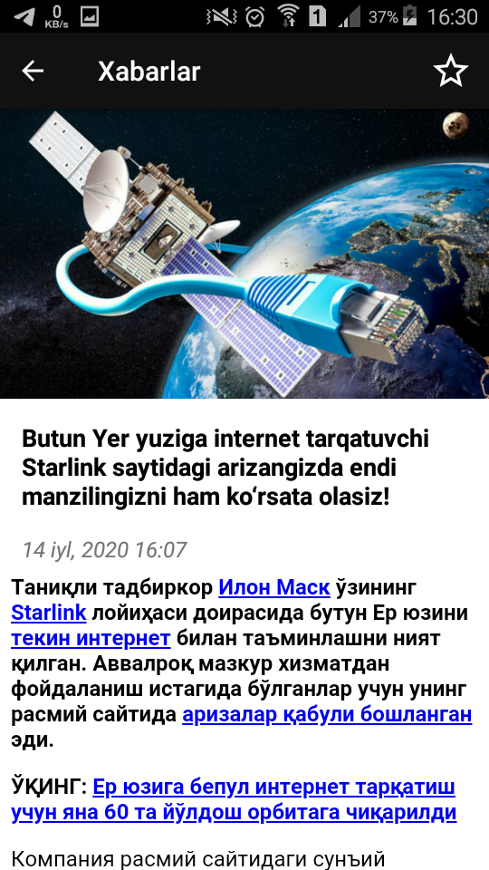

# Terrabayt
## Ishlatilgan texnalogiyalar
1. MVVM (arxitektera uchun)
2. Retrofit 2 / Gson (internetdan ma'lumot yuklash uchun)
3. Coroutines (oqimlar uchun)
4. Glide (rasm yuklash uchun)
5. Room (sqlite baza bilan ishlash uchun)

## Foydalanilgan API manzillari
```
base_url = https://www.terabayt.uz/
category = https://www.terabayt.uz/api.php?action=categories
posts = https://www.terabayt.uz/api.php?action=posts
posts parametrlari bilan = https://www.terabayt.uz/api.php?action=posts&first_update=0&last_update=0&category=0&limit=30
```

## Dastur sxemasi
### module
Internet, sqlite baza va qo'shimcha klasslar, funksiyalar. Bu module o'zi alohida hech qayerga bog'lanmagan.
### ui
Buyerda activity va uning adapter, holder, viewModel, presenterlari har biri o'ziga tegishli packageda saqlangan.
### App
Appda module qismlari yaratib olinib, xohlagan joydan turib ishlatilanadi. Buyerda asosan proyektni boshidan oxirigacha o'zgarmaydigan obyektlar yaratiladi. Masalan DatabaseProvider, NetProvider



## Yangiliklar


## Menu


## Child menu


## Mavzuga oid yangiliklar


## Yangilik matni


### Bog'lanish uchun
[Telegram](https://t.me/abbos2101)
[Facebook](https://www.facebook.com/abbos.bobomurodov.2101)
